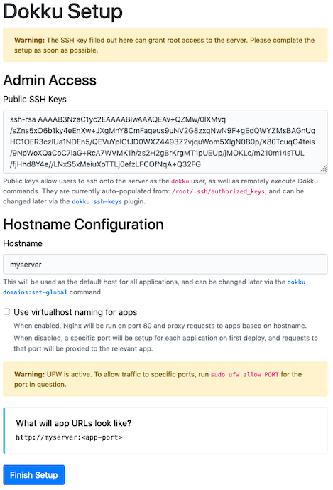

# Getting Started with Dokku

## What is Dokku?

Dokku is an extensible, open source Platform as a Service that runs on a single server of your choice.

To start using Dokku, you'll need a system that meets the following minimum requirements:

- A fresh installation of [Ubuntu x64 - Any currently supported release](https://www.ubuntu.com/download), [Debian 8.2 x64](https://www.debian.org/distrib/) or [CentOS 7 x64](https://www.centos.org/download/) *(experimental)* with the FQDN set <sup>[1]</sup>
- At least 1 GB of system memory <sup>[2]</sup>

You can *optionally* have a domain name pointed at the host's IP, though this is not necessary.

Dokku is designed for usage on a fresh VM installation, and should install all necessary dependencies if installing via the bootstrap method.

### Installing the latest stable version

#### 1. Install Dokku

To install the latest stable version of Dokku, you can run the following shell commands:

```shell
# for debian systems, installs Dokku via apt-get
wget https://raw.githubusercontent.com/dokku/dokku/v0.17.9/bootstrap.sh;
sudo DOKKU_TAG=v0.17.9 bash bootstrap.sh
```

The installation process takes about 5-10 minutes, depending upon internet connection speed.

If you're using Debian 8 or Ubuntu 14.04, make sure your package manager is configured to install a sufficiently recent version of nginx<sup>[3]</sup>, otherwise, the installation may fail due to `unmet dependencies` relating nginx.

#### 2. Setup SSH key and Virtualhost Settings

Once the installation is complete, you can open a browser to setup your SSH key and virtualhost settings. Open your browser of choice and navigate to the host's IP address - or the domain you assigned to that IP previously - and configure Dokku via the web admin.



Alternatively, instructions to skip the web installer with an unattended installation are available in the [advanced install guide](/docs/getting-started/advanced-installation/#configuring). 

> **Warning:** If you don't complete setup via the web installer (even if you set up SSH keys and virtual hosts otherwise) your Dokku installation will remain vulnerable to anyone finding the setup page and inserting their key. You can check if it is still running via `ps auxf | grep dokku-installer`, and it may be stopped via your server's init system - usually either `service dokku-installer stop` or `stop dokku-installer`.

> **Warning:** Web installer is not available on CentOS and Arch Linux. You will need to configure [SSH keys](/docs/deployment/user-management.md#adding-ssh-keys) and [virtual hosts](/docs/configuration/domains.md#customizing-hostnames) using dokku command line interface - see unattended installation linked above.

#### 3. Deploy your first application

Once you save your settings, the web admin will self-terminate and you should be able to run or [deploy to the Dokku installation](/docs/deployment/application-deployment.md).

### Installing via other methods

For various reasons, certain hosting providers may have other steps that should be preferred to the above. If hosted on any of the following popular hosts, please follow the linked to instructions:

- [DigitalOcean Installation Notes](/docs/getting-started/install/digitalocean.md)
- [DreamHost Cloud Installation Notes](/docs/getting-started/install/dreamhost.md)
- [Microsoft Azure Installation Notes](/docs/getting-started/install/azure.md)

As well, you may wish to customize your installation in some other fashion. or experiment with Vagrant. The guides below should get you started:

- [Debian Package Installation Notes](/docs/getting-started/install/debian.md)
- [RPM Package Installation Notes](/docs/getting-started/install/rpm.md)
- [Vagrant Installation Notes](/docs/getting-started/install/vagrant.md)
- [Advanced Install Customization](/docs/getting-started/advanced-installation.md)

---

- <sup>[1]: To check whether your system has an fqdn set, run `sudo hostname -f`</sup>
- <sup>[2]: If your system has less than 1GB of memory, you can use [this workaround](/docs/getting-started/advanced-installation.md#vms-with-less-than-1gb-of-memory).</sup>
- <sup>[3]: nginx >= 1.8.0 can be installed via the [nginx repositories](https://www.nginx.com/resources/admin-guide/installing-nginx-open-source/), or by adding [this PPA](https://launchpad.net/~nginx/+archive/ubuntu/stable) if you're using Ubuntu. nginx >= 1.11.5 is necessary for HTTP/2 support</sup>
